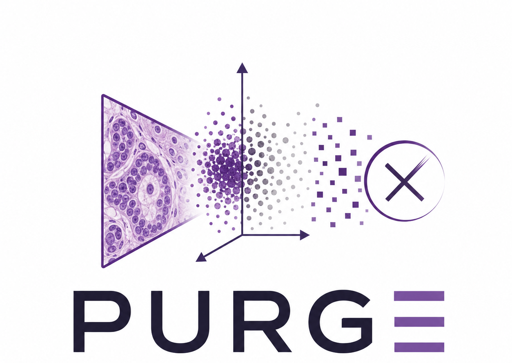

<p align="center">
  
</p>

<h1 align="center">Concept Poisoning in the Latent Space:<br>Pathology Unlearning via Representational Geometry Erasure</h1>

<p align="center">
  <a href="https://researchsubmissions66.github.io/PURGE/"></a>
  <a href="#"></a>
</p>

---

## Overview

**PURGE** is a framework for surgically erasing organ-specific geometric signatures from foundation model embeddings, without degrading downstream clinical utility on unrelated tasks. Unlike naive perturbation baselines (Gaussian noise, feature dropout) that destroy *all* predictive signal, PURGE mathematically projects embeddings into an orthogonal null space — selectively deleting the target concept while perfectly preserving others.

## Key Results

When a target organ's geometry is erased, downstream classifiers trained on those features collapse to random chance (~0.50 AUC), while classifiers for *all other organs* remain fully intact (>0.94 AUC).

## Datasets

| Dataset | Organ | Source |
|---------|-------|--------|
| **PANDA** | Prostate | Kaggle |
| **BRACS** | Breast | BReAst Carcinoma Subtyping |
| **TCGA-LUNG** | Lung | The Cancer Genome Atlas |
| **UBC-OCEAN** | Ovarian | UBC Ovarian Cancer |
| **BACH** | Breast | BreAst Cancer Histology |

## Foundation Models (Encoders)

| Model | Provider | Embedding Dim |
|-------|----------|---------------|
| **Hoptimus0** | Bioptimus | 768-D |
| **UNI** | Mahmood Lab | 1024-D |
| **Prov-GigaPath** | Providence / Microsoft | 1536-D |
| **Phikon-v2** | Owkin | 768-D |

## Unlearning Methods

| Method | Description |
|--------|-------------|
| **SVD Null-Space Projection** | Computes organ-specific principal components via SVD; projects all embeddings into the orthogonal complement to erase the target concept. |

## Baselines

| Baseline | Description |
|----------|-------------|
| **Gaussian Noise** | Adds isotropic Gaussian noise (σ = 0.1–1.0) to embeddings. |
| **Feature Dropout** | Randomly zeros out embedding dimensions (p = 0.1–0.9). |

## Repository Structure

```
PURGE/
├── docs/                          # Project website (GitHub Pages)
│   ├── index.html
│   ├── style.css
│   └── script.js
├── src/
│   ├── datasets/
│   │   └── feature_dataset.py     # HDF5 feature loading
│   ├── models/
│   │   ├── abmil.py               # Attention-Based MIL
│   │   ├── meanmil.py             # Mean-Pooling MIL
│   │   └── transmil.py            # Transformer MIL
│   └── unlearning/
│       ├── subspace.py            # SVD null-space projection
│       ├── ot_transport.py        # CORAL optimal transport
│       ├── wiener_filter.py       # Wiener spectral filter
│       └── noise.py               # Gaussian noise & dropout baselines
├── scripts/
│   ├── train_mil.py               # Main training & evaluation script
│   ├── compute_all_unlearners.py  # Pre-compute SVD unlearners
│   ├── compute_ot_unlearners.py   # Pre-compute OT unlearners
│   ├── aggregate_results.py       # Aggregate cross-evaluation results
│   └── run_sweep.sh               # SLURM sweep launcher
└── README.md
```

## Citation

```bibtex
@article{purge2025,
  title={Concept Poisoning in the Latent Space: Pathology Unlearning via Representational Geometry Erasure},
  author={Anonymous},
  year={2025},
  note={Under review}
}
```
